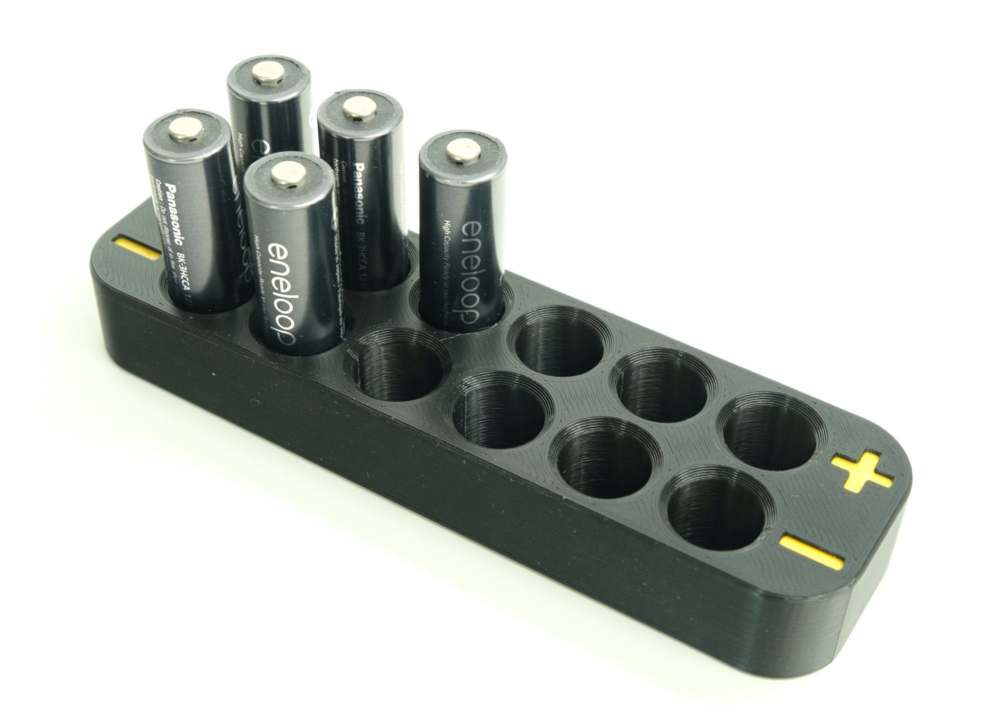
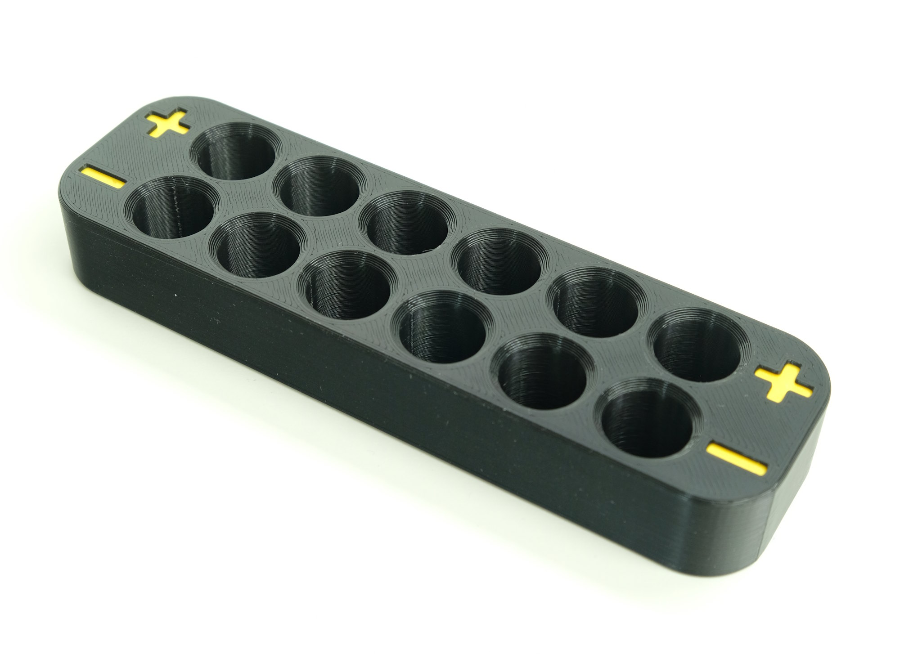
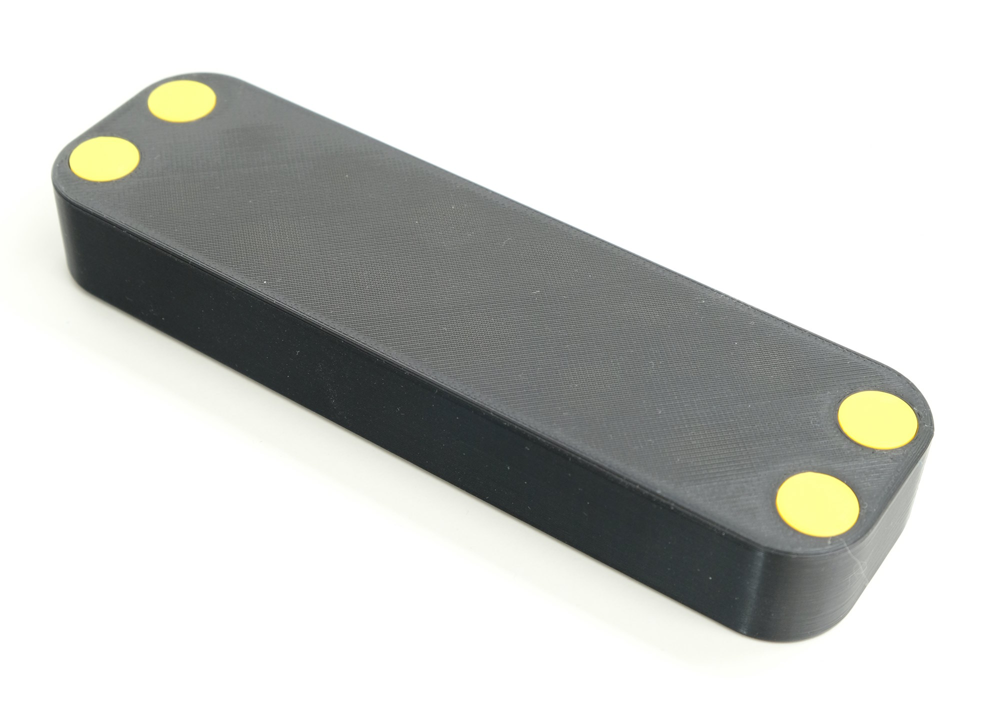
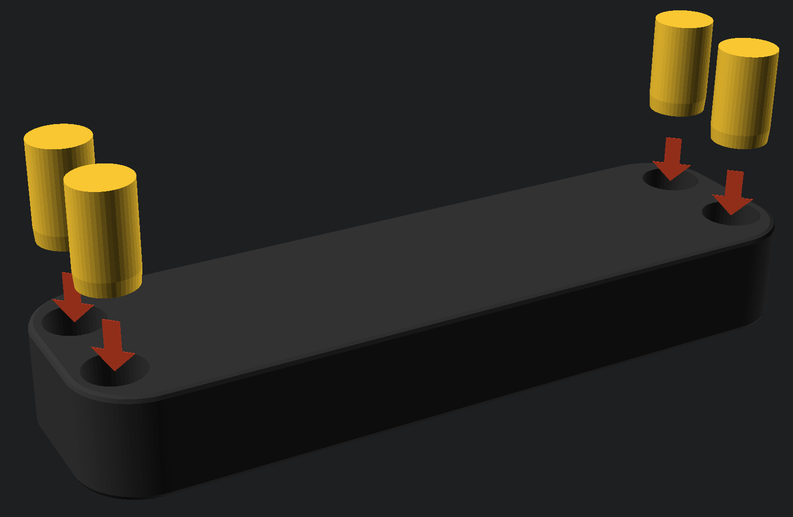
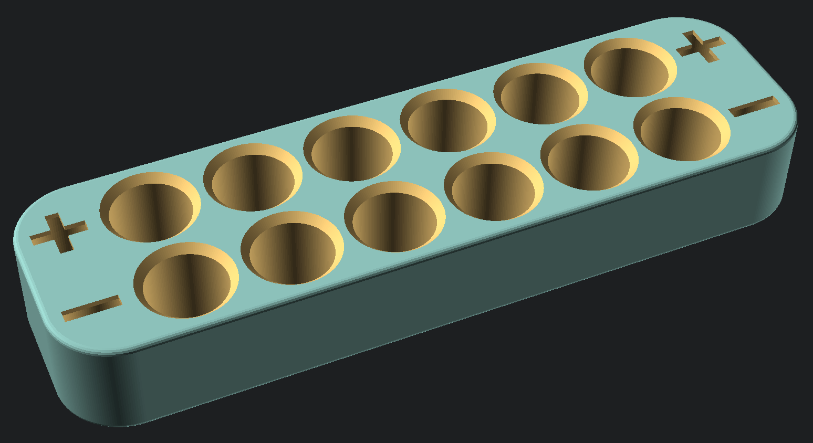
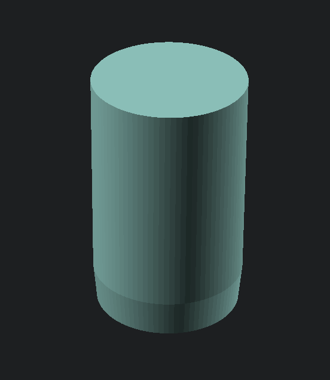

# Battery Holder

This battery holder helps organize rechargeable batteries. It has one row for charged batteries represented by a "+" sign, and one for negative batteries represented by a "-" sign. Both AA and AAA batteries are supported through different models.

|||
|-|-|
|||

## Printing

Any filament can be used for printing this project. The models are designed to be printed on a standard consumer grade FDM printer with a 0.4mm nozzle.

For each battery holder, print four symbol inserts.

## Assembly

Push the symbol inserts into the base with the end that was on the print bed facing down. The inserts should fit snugly, but not take an uncomfortable amount of pressure to push all the way in.

## Models in this Project

|Image|Name|File|Description|
|-|-|-|-|
||`battery holder`|`battery holder.scad`|The battery holder.|
||`symbol insert`|`battery holder.scad`|An insert for the +/- symbols that allows for a different color than the holder body.|

# Project Setup for Local Editing

Everything below this point is only relevant if you want to download this project and make edits.

## Cloning this Repository

This project uses a submodule for common SCAD code. If the submodule is not initialized, the `openscad-utilities` directory will be empty, and the project won't render.

To get the submodule code when cloning, add the `--recurse-submodules` option to the clone command. For example:
> `git clone [Project URL] --recurse-submodules`

If you've already cloned the project, run this command in the project root to pull down the submodule:
> `git submodule update --init`

## Exporting Model Files

There are two options for exporting the models:

1. Manually through the [OpenSCAD](https://openscad.org/) UI.
2. Through the provided export script.

As of 2024, the OpenSCAD development preview uses a new rendering engine called Manifold. Using the development preview with Manifold will render the models many times faster, regardless of how you export this project.

### 1. Exporting Manually

The `export map.scad` file contains an `if/else` condition where the call to generate each part can be seen. You can either write OpenSCAD code using these calls to build up a print plate, or the part "name" can be manually edited to select each part, which can then be rendered and exported through the OpenSCAD UI like any other project.

### 2. Exporting using the Script

The export script, `export.py`, depends on the [SCAD Export](https://github.com/CharlesLenk/scad_export) library. To use this script follow the instructions in the SCAD Export documentation.
